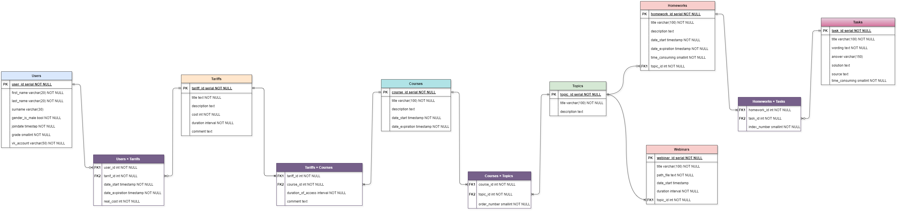

# Hatymov Renat, B05-224, Databases Course Project

## 1. Отношения (таблицы)
1. Users (ученики онлайн-школы)
2. Tariffs (тарифы (временный доступ к набору курсов))
3. Users × Tariffs (связывающая таблица, кто, какой тариф купил)
4. Courses (курсы с темами (папками))
5. Tariffs × Courses (связывающая таблица, какие курсы положено дать за приобретение тарифа, и когда действует доступ)
6. Topics (папки по темам с вебинарами и домашними заданиями к ним)
7. Courses × Topics(связывающая таблица, какие папки(темы) содержатся в каждом курсе)
8. Homeworks (домашние задания, состаящие из задач)
9. Vebinars (онлайн-занятия с сохранением запими)
10. Tasks (задачи для решения учениками)
11. Homeworks × Tasks (связывающая таблица, какие задачи есть в каждой домашке)
## Проектирование базы данных

### 2. Концептуальная модель

### 3. Логическая модель

Можно посмотреть в более хорошем качестве по адресу: ./diagrams/ER-logical.png
<!---
Надо лайфхак запомнить. drawio по умолчанию png без фона генерирует. Надо просто через paint октрыть и сохранить разок, тогда фон белым становится.

В psql primary key подразумевает not null по дефолту.
Вообще вся бд странная, потому что айдишники можно было через AUTOINCREMENT или SERIAL сделать.
-->

Данные отношения находятся в *1НФ*, так как их атрибуты атомарны, а строки различны внутри каждой из них.
Они находятся в *2НФ*, так как находятся в *1НФ* и каждый не ключевой атрибут неприводимо зависит от любого потенциального ключа.
Разберём подробнее возможные потенциальные ключи для каждой таблицы:
1. `Users` - `user_id`, `joindate` и `vk_account`. Остальные не подходят, так как могут быть повторы.
2. `Tariffs` - только `tariff_id`. Остальные не подходят, так как есть NULL и могут быть повторы.
3. `Courses` - `courses_id`.
4. `Topics` - `topic_id`.
5. `Homeworks` - `homework_id`. 
6. `Vebinars` - `vebinar_id`.
7. `Tasks` - `task_id`, `wording`.
8. Любые их произведения для связи отношения многие ко многим, очевидно, тоже обладают *2НФ*.

Таблица `Users × Tariffs` будет версионной, ведь пользователи периодически оплачивают новые тарифы. `SCD` (*Slowly changing dimensions*) будет типа $2$, то есть мы будем добавлять новые оплаты в нашу таблицу, не изменяя при этом старые записи.

### 4. Физическая модель
**Users:**
| Название | Описание | Тип данных | Ограничение |
| --------------- | --------------- | --------------- | --------------- |
| `user_id`    | Идентификатор | SERIAL | PRIMARY KEY |
| `first_name`    | Имя | VARCHAR(20) | NOT NULL |
| `last_name`    | Фамилия | VARCHAR(20) | NOT NULL |
| `surname` | Отчество | VARCHAR(30) ||
| `gender_is_male` | Пол | BOOL | NOT NULL|
| `joindate` | Дата регистрации | TIMESTAMP | NOT NULL |
| `grade` | Класс обучения | SMALLINT | NOT NULL |
| `vk_account`  | Аккаунт вк, с которого произошла регистрация | VARCHAR(50) | NOT NULL |

Вероятно класс нужно увеличивать на единицу каждое лето, а уже окончивших школу переносить в какую-то другую базу данных.

**Tariffs:**
| Название | Описание | Тип данных | Ограничение |
| --------------- | --------------- | --------------- | --------------- |
| `tariff_id`    | Идентификатор | SERIAL | PRIMARY KEY |
| `title`    | Название | TEXT | NOT NULL |
| `description` | Описание | TEXT | |
| `cost`    | Стоимость в рублях | INTEGER | NOT NULL |
| `duration` | Продолжительность действия | INTERVAL | NOT NULL|
| `comment` | Комментарий | TEXT | |

**Users × Tariffs:**
| Название | Описание | Тип данных | Ограничение |
| --------------- | --------------- | --------------- | --------------- |
| `user_id`    | Пользователь | INTEGER |NOT NULL, FOREIGN KEY REFERENCES Users(user_id)|
| `tariff_id`    | Тариф | INTEGER |NOT NULL, FOREIGN KEY REFERENCES Tariff(tariff_id)|
| `date_start` | Дата начала действия тарифа | TIMESTAMP | NOT NULL |
| `date_expiration` | Дата конца действия тарифа | TIMESTAMP | NOT NULL |
| `real_cost`  | Сколько на самом деле заплатил юзер | INTEGER | NOT NULL 

В случае новой оплаты того же тарифа просто добавляем новую строчку с другими датами, но теми же `tariff_id` и `user_id`.

**Courses:**
| Название | Описание | Тип данных | Ограничение |
| --------------- | --------------- | --------------- | --------------- |
| `course_id`    | Идентификатор | SERIAL | PRIMARY KEY |
| `title`    | Название | VARCHAR(100) | NOT NULL |
| `description` | Описание | TEXT | |
| `date_start` | Дата начала курса | TIMESTAMP | NOT NULL |
| `date_expiration` | Дата конца курса | TIMESTAMP | NOT NULL |

**Tariffs × Courses:**
| Название | Описание | Тип данных | Ограничение |
| --------------- | --------------- | --------------- | --------------- |
| `tariff_id`    | Тариф | INTEGER |NOT NULL, FOREIGN KEY REFERENCES Tariff(tariff_id)|
| `course_id`    | Курс | INTEGER |NOT NULL, FOREIGN KEY REFERENCES Courses(course_id)|
| `duration_of_access` | Длительность доступа | INTERVAL | NOT NULL |
| `comment` | Комментарий | TEXT | |

Общий смысл таблицы в возможности давать курсы по разным предметам для одного тарифа. Смысл длительности доступа в том, что мы хотим бесплатно давать доступ к другим курсам на некоторое время при покупке дорогих тарифов. Типа подарок.

**Topics:**
| Название | Описание | Тип данных | Ограничение |
| --------------- | --------------- | --------------- | --------------- |
| `topic_id`    | Идентификатор | SERIAL | PRIMARY KEY |
| `title`    | Название | VARCHAR(100) | NOT NULL |
| `description` | Описание | TEXT | |

Смысл в том, что мы хотим давать людям с разных курсов доступ к какой-то группе вебинаров и дз (topic), посвященных определённому блоку тем, чтобы экономить время преподавателей.

**Courses × Topics:**
| Название | Описание | Тип данных | Ограничение |
| --------------- | --------------- | --------------- | --------------- |
| `course_id`    | Курс | INTEGER | NOT NULL, FOREIGN KEY REFERENCES Courses(course_id)|
| `topic_id`    | Тема | INTEGER | NOT NULL, FOREIGN KEY REFERENCES Topics(topic_id)|
| `order_number` | Порядковый номер для правильного отображения | SMALLINT | NOT NULL |

**Homeworks:**
| Название | Описание | Тип данных | Ограничение |
| --------------- | --------------- | --------------- | --------------- |
| `homework_id`    | Идентификатор | SERIAL | PRIMARY KEY |
| `title`    | Название | VARCHAR(100) | NOT NULL |
| `description` | Описание | TEXT | |
| `date_start` | Дата начала сдачи дз | TIMESTAMP | NOT NULL |
| `date_expiration` | Дедлайн | TIMESTAMP | NOT NULL |
| `time_consuming` | Предположительная времязатратность в минутах|SMALLINT| NOT NULL|
| `topic_id` | Тема | INTEGER | NOT NULL, FOREIGN KEY REFERENCES Topics(topic_id)|

**Webinars:**
| Название | Описание | Тип данных | Ограничение |
| --------------- | --------------- | --------------- | --------------- |
| `webinar_id`    | Идентификатор | SERIAL | PRIMARY KEY |
| `title`    | Название | VARCHAR(100) | NOT NULL |
|`path_file`| Путь к файлу для записи |TEXT | NOT NULL|
| `date_start` | Дата начала | TIMESTAMP |
| `duration` | Предполагаемая продолжительность вебинара| INTERVAL | NOT NULL |
| `topic_id` | Тема | INTEGER |NOT NULL, FOREIGN KEY REFERENCES Topics(topic_id)|

Это могут быть как заранее записанные видео, так и онлайн-занятия в прямом эфире.

**Tasks:**
| Название | Описание | Тип данных | Ограничение |
| --------------- | --------------- | --------------- | --------------- |
| `task_id`    | Идентификатор | SERIAL | PRIMARY KEY |
| `title`    | Название | VARCHAR(100) | NOT NULL |
| `wording`    | Условие | TEXT | NOT NULL |
| `answer`    | Ответ | VARCHAR(150) | |
| `solution`    | Решение | TEXT | |
| `source`    | Источник | TEXT | |
| `time_consuming` | Предположительная времязатратность в минутах |SMALLINT| NOT NULL|

**Homeworks × Tasks:**
| Название | Описание | Тип данных | Ограничение |
| --------------- | --------------- | --------------- | --------------- |
| `homework_id`    | Задание (домашнее) | INTEGER |NOT NULL, FOREIGN KEY REFERENCES Homework(homework_id)|
| `task_id`    | Задача (таска)| INTEGER |NOT NULL, FOREIGN KEY REFERENCES Tasks(task_id)|
| `index_number` | Порядковый номер для правильного отображения | SMALLINT | NOT NULL |

