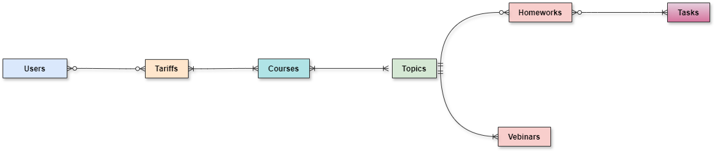

# Hatymov Renat, B05-224, Databases Course Project

## 1. Отношения (таблицы)
1. Users (ученики онлайн-школы)
2. Tariffs (тарифы (временный доступ к набору курсов))
3. Users × Tariffs (связывающая таблица, кто, какой тариф купил)
4. Courses (курсы с темами (папками))
5. Tariffs × Courses (связывающая таблица, какие курсы положено дать за приобретение тарифа, и когда действует доступ)
6. Topics (папки по темам с вебинарами и домашними заданиями к ним)
7. Courses × Topics(связывающая таблица, какие папки(темы) содержатся в каждом курсе)
8. Homeworks (домашние задания, состаящие из задач)
9. Vebinars (онлайн-занятия с сохранением запими)
10. Tasks (задачи для решения учениками)
11. Homeworks × Tasks (связывающая таблица, какие задачи есть в каждой домашке)
## Проектирование базы данных

### 2. Концептуальная модель

### 3. Логическая модель

Можно посмотреть в более хорошем качестве по адресу: diagrams/ER-logical.png

Данные отношения находятся в *1НФ*, так как их атрибуты атомарны, а строки различны внутри каждой из них.
Они находятся в *2НФ*, так как находятся в *1НФ* и каждый не ключевой атрибут неприводимо зависит от любого потенциального ключа.
Разберём подробнее возможные потенциальные ключи для каждой таблицы:
1. `Users` - `user_id`, `joindate` и `vk_account`. Остальные не подходят, так как могут быть повторы.
2. `Tariffs` - только `tariff_id`. Остальные не подходят, так как есть NULL и могут быть повторы.
3. `Courses` - `courses_id`.
4. `Topics` - `topic_id`.
5. `Homeworks` - `homework_id`. 
6. `Vebinars` - `vebinar_id`.
7. `Tasks` - `task_id`, `wording`.
8. Любые их произведения для связи отношения многие ко многим, очевидно, тоже обладают *2НФ*.

Так же для таблицы Users × Tariffs достпуна **версионность** в формате, учится ли данный пользователь в данный момент по данному тарифу.

### 4. Физическая модель
**Users:**
| Название | Описание | Тип данных | Ограничение |
| --------------- | --------------- | --------------- | --------------- |
| `user_id`    | Идентификатор | INTEGER | PRIMARY KEY |
| `first_name`    | Имя | VARCHAR(20) | NOT NULL |
| `last_name`    | Фамилия | VARCHAR(20) | NOT NULL |
| `surname` | Отчество | VARCHAR(30) ||
| `gender_is_male` | Пол | BOOL | NOT NULL|
| `joindate` | Дата регистрации | TIMESTAMP | NOT NULL |
| `grade` | Класс обучения | SMALLINT | NOT NULL |
| `vk_account`  | Аккаунт вк, с которого произошла регистрация | VARCHAR(50) | NOT NULL |

**Tariffs:**
| Название | Описание | Тип данных | Ограничение |
| --------------- | --------------- | --------------- | --------------- |
| `tariff_id`    | Идентификатор | INTEGER | PRIMARY KEY |
| `title`    | Название | TEXT | NOT NULL |
| `description` | Описание | TEXT | |
| `cost`    | Стоимость в рублях | INTEGER | NOT NULL |
| `duration` | Продолжительность действия | INTERVAL | NOT NULL|
| `comment` | TEXT | NOT NULL |

**Users × Tariffs:**
| Название | Описание | Тип данных | Ограничение |
| --------------- | --------------- | --------------- | --------------- |
| `user_id`    | Пользователь | INTEGER | FOREIGN KEY REFERENCES Users(user_id)|
| `tariff_id`    | Тариф | INTEGER | FOREIGN KEY REFERENCES Tariff(tariff_id)|
| `date_start` | Дата начала действия тарифа | TIMESTAMP | NOT NULL |
| `date_expiration` | Дата конца действия тарифа | TIMESTAMP | NOT NULL |
| `real_cost`  | Сколько на самом деле заплатил юзер | INTEGER | NOT NULL 

В случае новой оплаты того же тарифа, например при ежемесячном платеже, мы должны учесть как старые, так и новые даты действия тарифа.

**Courses:**
| Название | Описание | Тип данных | Ограничение |
| --------------- | --------------- | --------------- | --------------- |
| `course_id`    | Идентификатор | INTEGER | PRIMARY KEY |
| `title`    | Название | VARCHAR(100) | NOT NULL |
| `description` | Описание | TEXT | |
| `date_start` | Дата начала курса | TIMESTAMP | NOT NULL |
| `date_expiration` | Дата конца курса | TIMESTAMP | NOT NULL |

**Tariffs × Courses:**
| Название | Описание | Тип данных | Ограничение |
| --------------- | --------------- | --------------- | --------------- |
| `tariff_id`    | Тариф | INTEGER | FOREIGN KEY REFERENCES Tariff(tariff_id)|
| `course_id`    | Курс | INTEGER | FOREIGN KEY REFERENCES Courses(course_id)|
| `date_start_of_access` | Дата выдачи досутпа | TIMESTAMP | NOT NULL |
| `date_expiration_of_access` | Дата конца доступа | TIMESTAMP | NOT NULL |

**Topics:**
| Название | Описание | Тип данных | Ограничение |
| --------------- | --------------- | --------------- | --------------- |
| `topic_id`    | Идентификатор | INTEGER | PRIMARY KEY |
| `title`    | Название | VARCHAR(100) | NOT NULL |
| `description` | Описание | TEXT | |

Смысл в том, что мы хотим давать людям с разных курсов доступ к какой-то группе вебинаров и дз (topic), посвященные определённой теме.

**Courses × Topics:**
| Название | Описание | Тип данных | Ограничение |
| --------------- | --------------- | --------------- | --------------- |
| `course_id`    | Курс | INTEGER | FOREIGN KEY REFERENCES Courses(course_id)|
| `topic_id`    | Тема | INTEGER | FOREIGN KEY REFERENCES Topics(topic_id)|
| `order_number` | Порядковый номер для правильного отображения | SMALLINT | NOT NULL |

**Homeworks:**
| Название | Описание | Тип данных | Ограничение |
| --------------- | --------------- | --------------- | --------------- |
| `homework_id`    | Идентификатор | INTEGER | PRIMARY KEY |
| `title`    | Название | VARCHAR(100) | NOT NULL |
| `description` | Описание | TEXT | |
| `date_start` | Дата начала сдачи дз | TIMESTAMP | NOT NULL |
| `date_expiration` | Дедлайн | TIMESTAMP | NOT NULL |
| `time-consumping(min)` | предположительная времязатратность |SMALLINT| NOT NULL|
| `topic_id` | Тема | INTEGER | FOREIGN KEY REFERENCES Topics(topic_id)|

**Vebinars:**
| Название | Описание | Тип данных | Ограничение |
| --------------- | --------------- | --------------- | --------------- |
| `vebinar_id`    | Идентификатор | INTEGER | PRIMARY KEY |
| `title`    | Название | VARCHAR(100) | NOT NULL |
|`path_file`| Путь к файлу для записи|TEXT | NOT NULL|
| `date_start` | Дата начала | TIMESTAMP | NOT NULL |
| `duration` | Продолжительность вебинара| INTERVAL | NOT NULL |
| `topic_id` | Тема | INTEGER | FOREIGN KEY REFERENCES Topics(topic_id)|

**Tasks:**
| Название | Описание | Тип данных | Ограничение |
| --------------- | --------------- | --------------- | --------------- |
| `task_id`    | Идентификатор | INTEGER | PRIMARY KEY |
| `title`    | Название | VARCHAR(100) | NOT NULL |
| `wording`    | Условие | TEXT | NOT NULL |
| `solution`    | Решение | TEXT | |
| `source`    | Источник | TEXT | |
| `time-consumping(min)` | предположительная времязатратность |SMALLINT| NOT NULL|

**Homeworks × Tasks:**
| Название | Описание | Тип данных | Ограничение |
| --------------- | --------------- | --------------- | --------------- |
| `homework_id`    | Курс | INTEGER | FOREIGN KEY REFERENCES Homework(homework_id)|
| `task_id`    | Тема | INTEGER | FOREIGN KEY REFERENCES Tasks(task_id)|
| `index_number` | Порядковый номер для правильного отображения | SMALLINT | NOT NULL |

